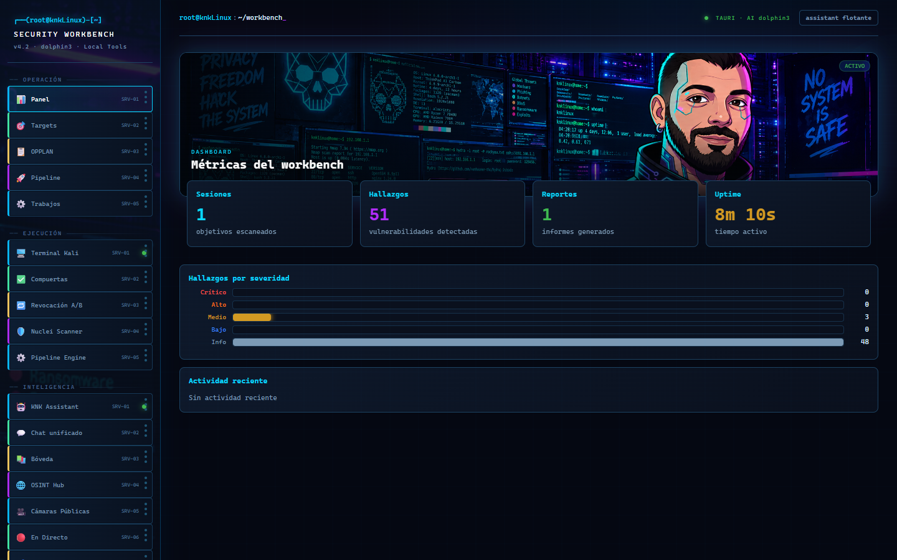
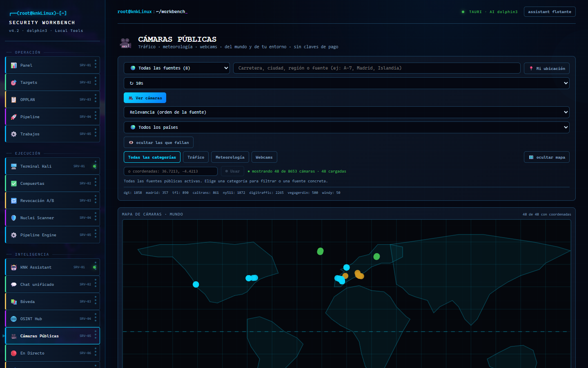
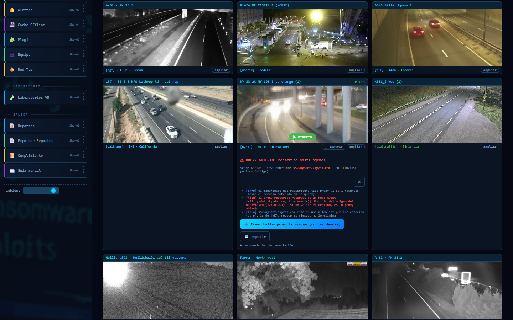

# KNK Suite — knkLinux Security Workbench


**KNK Suite** es una estación de trabajo local de ciberseguridad: pipeline completo
de bug bounty y threat hunting, centro de operaciones de cámaras (públicas y de
tu LAN), terminal Kali embebida y asistente LLM local — todo en una app de
escritorio con estética de SOC y sin que nada salga de tu máquina salvo el
tráfico que tú autorizas.

> La herramienta bloquea lo no autorizado (fail-closed), pero la responsabilidad
> de respetar el scope y las reglas de cada programa es del operador. Sin
> autorización escrita: no ejecutes. [Aviso legal completo](#-aviso-legal--uso-ético).

---

## 🖼️ El workbench en imágenes

Capturas reales de la app (resolución nativa 1440×900, tomadas sobre la build actual):

### Panel principal



_Métricas del workbench, sesiones, hallazgos por severidad y actividad reciente._

### Centro de cámaras públicas



_8 fuentes keyless (DGT, Madrid, TfL, Caltrans, 511NY, Digitraffic, Vegagerðin, Windy),
mapa mundial con 48 cámaras en pantalla y filtros por país/categoría/distancia._

### Auditoría de proxies HLS



_Botón 🛡 en cada tarjeta con chip HLS: análisis del manifiesto que detecta reescritura
de hosts ajenos (proxy abierto → SSRF), con sonda activa opt-in y conversión a hallazgo._

---

## ✨ Qué incluye

### Pipeline ofensivo (con autorización)
- **OPPLAN fail-closed**: sin plan aprobado + scope + autorización, el pipeline no ejecuta nada.
- **RECON** (subdominios, URLs históricas, tecnologías) → **SCAN** (headers, CORS, CVEs/NVD, Nuclei) → **FUZZ** → **playbook de explotación manual** en 6 fases.
- **Lógica de negocio**: ~35 tests concretos en 8 categorías (precio, race conditions, cupones, authz, estado de objetos…).
- **Compuertas de validación** por tipo de hallazgo (CORS, IDOR, SSRF, XSS, subdomain takeover, bizlogic) antes de permitir el reporte.
- **Reportes** con checklist de triage, exportación HTML/PDF, evidencia versionada y verificación "como triager".

### Cámaras — el módulo más completo
- **Cámaras públicas en directo** (fuentes oficiales *keyless*): DGT y Madrid CCTV (España), TfL JamCams (Londres), Caltrans (California), 511NY (Nueva York), Digitraffic (Finlandia), Vegagerðin (Islandia) y Windy Webcams (mundo). Mapa mundial, filtros por país/ciudad/distancia, snapshots por proxy same-origin y **vídeo HLS en directo** sin abrir la CSP.
- **Cámaras expuestas / LAN**: auditoría de tu red autorizada (RTSP/ONVIF), relay de red privada, conversión de objetivos y CVEs en hallazgos de la misión con evidencia.
- **Auditoría de proxies HLS** (`hls-proxy-audit`): detecta reescritura de hosts ajenos (proxy abierto → SSRF) con análisis pasivo del manifiesto, sonda activa opt-in y conversión a hallazgo con evidencia — disponible por API y con botón 🛡 en cada tarjeta.
- **Hallazgos ↔ informe**: todo lo analizado entra como hallazgo con evidencia exportable al reporte final.

### Escritorio knkLinux (Tauri 2)
- Instalador **NSIS/MSI** (`npm run tauri:build`), modo web con `npm start`, y asistente flotante.
- **Terminal Kali embebida** (PTY real sobre WebSocket) con selección automática de runtime: **WSL2 → VirtualBox por SSH → Docker**.
- **Watchdog de procesos**: el backend node vive en un Job Object de Windows — si el exe muere, el kernel mata el árbol; y al arrancar barre huérfanos de sesiones anteriores.
- **Bootstrap autenticado**: token de API en `~/.knk-suite/api-token` entregado al webview como cookie `HttpOnly` (o cabecera `X-KNK-Token` para clientes programáticos).
- Módulos: KNK Assistant (LLM local vía Ollama), bóveda cifrada, OSINT hub, red **Tor**, alertas en vivo, cache offline, plugins, compliance y reportes.

### Defensivo / threat hunting
- Análisis de logs (IoCs, anomalías, fuerza bruta, MITRE ATT&CK), ingesta CTI (texto/CSV/STIX), runbooks, inventario de assets (CMDB local), purple team (hallazgo → Sigma) e informe de engagement profesional.

---

## 🔒 Seguridad por diseño

| Capa | Detalle |
|---|---|
| Autorización | OPPLAN obligatorio; scope estricto (wildcards solo subdominios); fail-closed |
| SSRF | Allowlist + validación de IP pública; privadas y metadata cloud bloqueadas siempre |
| Auth de API | Token SIEMPRE exigido en `/api/*` (cookie `knk_token` o `X-KNK-Token`); solo `/health` público |
| Origen | Solo sockets loopback y orígenes locales; CORS restringido a localhost |
| Secretos | Guardián de **pre-commit** propio (13 reglas, `ci/secret-check.mjs`) + **gitleaks** en CI con historial completo |
| Datos | 100% locales (SQLite + ficheros de evidencia); sin telemetría |
| Rate limit | Retardos mínimos, modo stealth, fuzz masivo solo con autorización explícita |

---

## 🚀 Instalación y arranque

### Requisitos
- **Node.js 18+** (probado en 22 y 24)
- Opcional: **Docker** *o* **WSL2 con Kali** *o* **VirtualBox con Kali** (la terminal elige el mejor runtime disponible), **Ollama** (mentor local, modelos 3B-4B en portátiles), **Python 3** (puentes auxiliares)

### Modo web (desarrollo / servidor local)
```bash
git clone https://github.com/knklinux/knk-suite.git && cd knk-suite
npm run setup          # instala backend + frontend
npm test               # suite de tests unitarios
npm run build          # compila el frontend React
npm start              # http://127.0.0.1:8086
```

### App de escritorio (Tauri)
```bash
npm run tauri:build    # genera NSIS + MSI en src-tauri/target/release/bundle/
```
El instalador incrusta backend + frontend compilado y requiere `node.exe`
(en `C:\Program Files\nodejs` o `KNK_NODE_EXE`). Arranque en desarrollo:
`npm run tauri:dev`.

### Uso básico
1. Configura tu programa: `node backend/onboard.js --name "Programa" --target app.example.com --scope-file scope.txt` (o pega el scope desde la UI).
2. Revisa el scope parseado y marca la autorización en **OPPLAN**.
3. Valida en seco: `node backend/headless.js --check`.
4. Ejecuta el pipeline (UI o `POST /api/pipeline/full`). FUZZ/EXPLOIT entregan el playbook; la explotación es tuya.
5. Valida hallazgos con las compuertas, genera y verifica el reporte antes de enviarlo.

---

## 🧪 Tests y CI

```bash
npm test               # 52 tests unitarios
npm run test:cameras   # índice, auditoría, webcams públicas, LAN relay, expuestas, hallazgos, HLS audit
npm run test:tor       # módulo Tor
npm run test:modules   # cámaras + tor + auth-gate
npm run smoke          # smoke del servidor
npm run secret:check   # escáner de secretos sobre el árbol completo
```
CI (`.github/workflows/ci.yml`): build + tests + smoke + **secret scan (tree)** y job **gitleaks** independiente con escaneo de historial completo.

---

## 📁 Estructura

```
backend/
  index.js               Servidor Express + WebSocket + router único de upgrades
  lib/
    net.js               Núcleo: scope, SSRF, rate limit, allowlist
    pipeline.js          Orquestador de 7 fases · opplan.js  Autorización
    auth.js              Token, cookie de sesión, CORS local, saneo de comandos
    public-webcams.js    Catálogo keyless de cámaras públicas (8 fuentes)
    public-webcams-router.js  Proxy same-origin HLS + hls-audit + hallazgos
    exposed-cameras.js   Auditoría de cámaras en tu red autorizada
    hls-proxy-audit.js   Check de proxies HLS mal configurados (SSRF)
    kali.js              Runtimes Kali: WSL2 → VirtualBox SSH → Docker
    tor.js               Red Tor · llm.js  Mentor LLM (Ollama + fallback)
    gates.js             Compuertas por tipo · report.js/verifier.js  Informes
    hunt.js cti.js runbooks.js assets.js purpleteam.js engagement.js
frontend/src/            React: 43 componentes (dashboard, pipeline, cámaras, terminal, tor…)
src-tauri/               Shell de escritorio (Tauri 2): watchdog, bootstrap, instaladores
ci/secret-check.mjs      Guardián de secretos (pre-commit + backstop)
data/                    Programas candidatos curados
docs/                    Decisiones, auditorías y guías (ver tabla abajo)
```

### Documentación destacada (`docs/`)
| Doc | Contenido |
|---|---|
| [GUIA-USUARIO-KNKLINUX.md](docs/GUIA-USUARIO-KNKLINUX.md) | Guía de usuario del workbench |
| [CAMARAS-PUBLICAS-2026-09-11.md](docs/CAMARAS-PUBLICAS-2026-09-11.md) / [CAMARAS-EXPUESTAS-Y-FILTROS-2026-09-11.md](docs/CAMARAS-EXPUESTAS-Y-FILTROS-2026-09-11.md) | Módulos de cámaras |
| [HALLAZGOS-CAMARAS-E-INFORME-2026-09-11.md](docs/HALLAZGOS-CAMARAS-E-INFORME-2026-09-11.md) | Objetivos → hallazgos → informe |
| [BOOTSTRAP-COOKIE-KNK-TOKEN-2026-09-14.md](docs/BOOTSTRAP-COOKIE-KNK-TOKEN-2026-09-14.md) | Autenticación del arranque del escritorio (cookie `knk_token`, primer arranque limpio) |
| [TOR-2026-09-11.md](docs/TOR-2026-09-11.md) / [INSTALAR-KALI-WSL2.md](docs/INSTALAR-KALI-WSL2.md) | Red Tor / runtime Kali |
| [TUNNEL-TRYCLOUDFLARE-2026-09-15.md](docs/TUNNEL-TRYCLOUDFLARE-2026-09-15.md) | Ciclo de vida del quick tunnel (URL efímera, DNS, rescate 1.1.1.1) |
| [bugbounty/](docs/bugbounty/) | Protocolos de operación y re-tests |

---

## 🤝 Contribuir

Issues y PRs bienvenidos. Antes de enviar un PR:
- `npm test` y `npm run build` en verde (el CI lo comprobará también con gitleaks).
- Sin secretos: el hook de pre-commit (`git config core.hooksPath .githooks` se activa con `npm install`) bloquea tokens/cookies/claves; el marcador de excepción para fixtures es `knk-secret-ok`.
- Documenta el cambio si añade un módulo o cambia el modelo de auth.

---

## ⚖️ Aviso legal / uso ético

KNK Suite solo debe usarse contra objetivos que te **autorizan expresamente**
(programas de bug bounty, engagements de pentest, laboratorios propios y tu
propia red). El modelo fail-closed existe para eso: la herramienta bloquea lo
no autorizado, pero la responsabilidad final de respetar el scope, las reglas
de participación (RoE) y la legislación aplicable es del operador. Los módulos
de cámaras siguen el mismo principio: fuentes públicas oficiales y tu LAN
autorizada — nunca dispositivos ajenos. Sin autorización escrita: no ejecutes.

## 📦 Avisos de terceros

KNK Suite es MIT, pero se apoya en software de terceros que conserva sus propias licencias. Las clave (por relevancia y peso en los binarios):

| Dependencia | Uso | Licencia |
|---|---|---|
| [React](https://github.com/facebook/react) + ReactDOM | UI del frontend | MIT |
| [Vite](https://github.com/vitejs/vite) | Build tool | MIT |
| [Tauri](https://github.com/tauri-apps/tauri) | Shell de escritorio | Apache-2.0 OR MIT |
| [Express](https://github.com/expressjs/express) | Servidor backend | MIT |
| [better-sqlite3](https://github.com/WiseLibs/better-sqlite3) | Persistencia local | MIT |
| [node-pty](https://github.com/microsoft/node-pty) | Terminales reales (Kali/WSL) | MIT |
| [ws](https://github.com/websockets/ws) | WebSockets | MIT |
| [hls.js](https://github.com/video-dev/hls.js) | Reproducción HLS de cámaras | Apache-2.0 |
| [xterm](https://github.com/xtermjs/xterm.js) + addon-fit | Terminal web | MIT |
| [satellite.js](https://github.com/shashwatak/satellite.js) | Cálculo orbital | MIT |
| [sql.js](https://github.com/sql-js/sql.js) | SQLite WASM | MIT |
| [whisper-node](https://github.com/petewarden/whisper-node) | Transcripción local | MIT |

Licencia completa de cada paquete en su `node_modules/<pkg>/LICENSE`; el runtime de WebView2/Edge (Microsoft) se rige por sus propios términos.

## 📄 Licencia

[MIT](LICENSE) — uso educativo y de investigación responsable. Consulta el fichero [LICENSE](LICENSE) para el texto completo.
